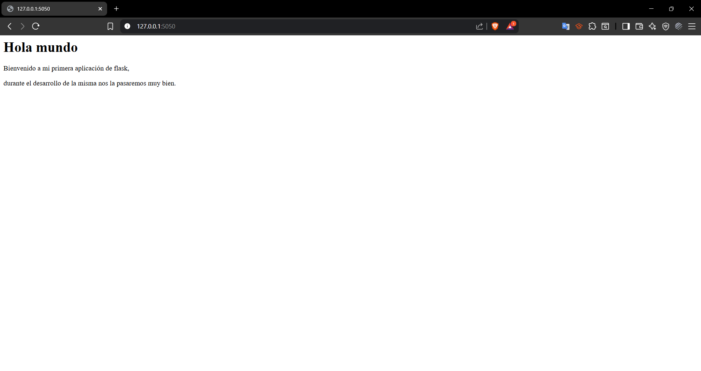

# 📝 Proyecto Básico con Flask

Este repositorio contiene una plantilla inicial para una aplicación web desarrollada con el framework **Flask**. El propósito de este proyecto es ofrecer una estructura de directorios organizada y un punto de partida funcional para construir aplicaciones más complejas.

## 📂 Estructura del Proyecto

El proyecto sigue una organización modular para separar la lógica, las plantillas y los archivos estáticos.

```
tu_app/
├── app/
│   ├── static/
│   ├── templates/
│   │   └── home.html
│   ├── __init__.py
│   └── views.py
├── config.py
├── run.py
├── requirements.txt
└── .gitignore
```

## 🚀 Instalación y Configuración

Sigue estos pasos para poner en marcha el proyecto en tu entorno local.

1.  **Clona el repositorio**.

2.  **Navega a la carpeta del proyecto**:

    ```bash
    cd tu_app
    ```

3.  **Crea y activa un entorno virtual**:

    ```bash
    # Crear entorno
    python -m venv venv

    # Activar en Windows
    .\venv\Scripts\activate

    # Activar en macOS/Linux
    source venv/bin/activate
    ```

4.  **Instala las dependencias**:

    ```bash
    pip install -r requirements.txt
    ```

5.  **Configura tu clave secreta**:
    Abre el archivo `config.py` y asegúrate de que la variable `SECRET_KEY` tenga un valor único y seguro.

## ▶️ Ejecución

Una vez que el entorno está configurado, puedes iniciar el servidor de desarrollo.

1.  Ejecuta el siguiente comando en tu terminal:
    ```bash
    python run.py
    ```
2.  Abre tu navegador web y visita la siguiente URL para ver la aplicación (generalmente es):
    [http://127.0.0.1:5050](http://127.0.0.1:5050)

3.  Resultado
    
